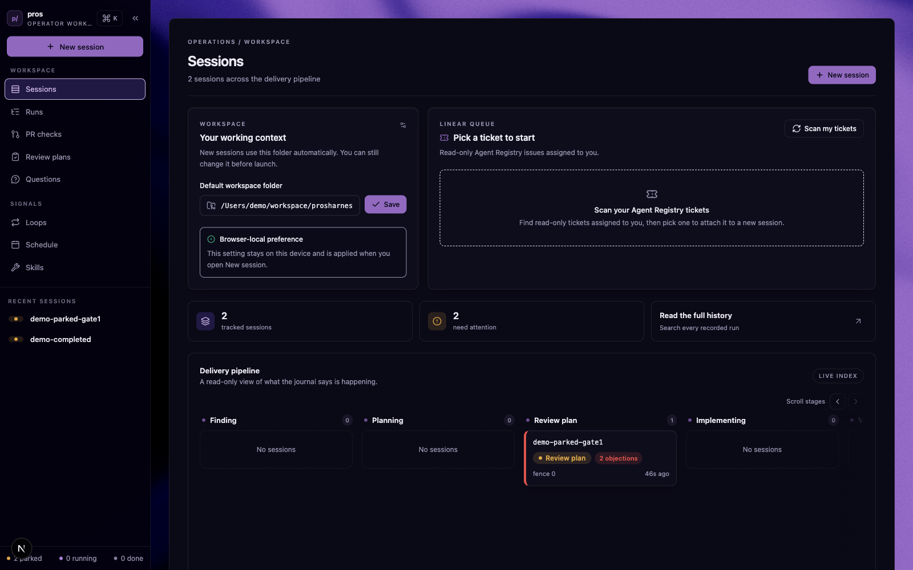
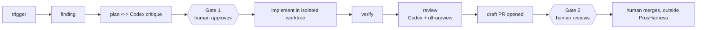
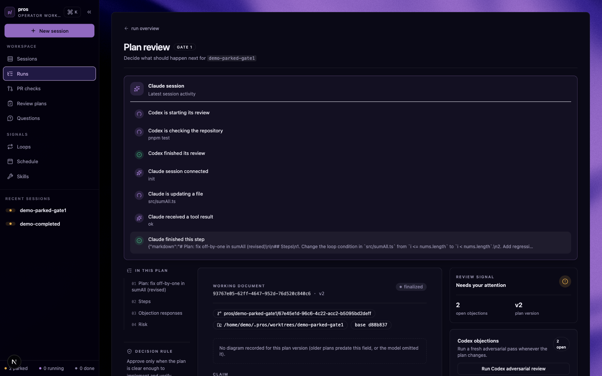
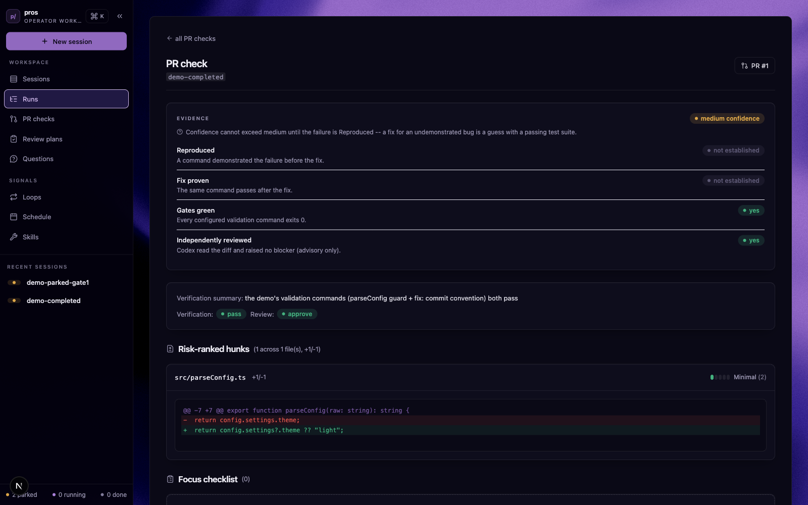
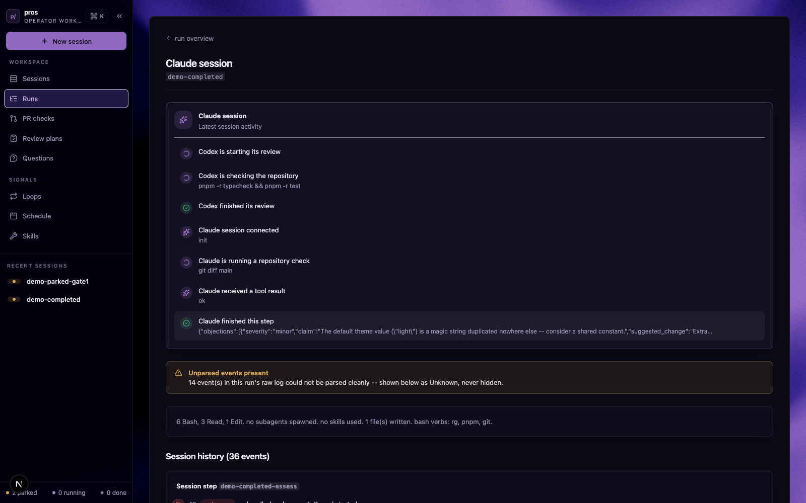

# ProsHarness

ProsHarness is a local software factory for Claude Code and Codex. A trigger
becomes a finding, the finding becomes a plan that Claude and Codex have
already argued over, a human approves the plan, an implementation runs in an
isolated Git worktree, and a second human reviews the resulting draft PR.

**The system never merges a PR.** That is a deliberate invariant, not a
missing feature. The bottleneck this project is solving is the operator's
attention, not model capability - so the two places a human is required are
kept small, asynchronous, and reviewable from a phone, and everything else
is engineered to make those two decisions safe to make without losing work
if a laptop sleeps or a daemon crashes mid-wait.

This is a pnpm workspace of TypeScript packages. The browser dashboard is
one client of the orchestration system, not the system of record - the
journal on disk is.



## The two human gates

| Gate | Question it answers | Where |
|---|---|---|
| Gate 1 - plan approval | Should this plan run at all? | `/runs/<id>/plan` |
| Gate 2 - PR review | Should this diff merge? | `/runs/<id>/review` |

Both are durable checkpoints, not a live process waiting on you. A run that
parks at a gate owns no running model session - it records the checkpoint,
freezes and kills its own process tree with the tool call still in flight,
and resumes later from a manifest on disk. This matters because a returning
MCP tool call does not end a model's turn: if `ask_human` just returned a
value, the model would keep writing and could act past the point a human was
supposed to weigh in. Checkpointing and killing the process is what actually
closes that gap.

Each decision card is built from four independently-checkable evidence
signals rather than a model's self-reported confidence, which is
uncalibrated and tends to peak exactly when the model has misread the
problem:

- **Reproduced** - a command demonstrated the failure before the fix.
- **Fix proven** - the same command passes after the fix.
- **Gates green** - every configured validation command exits 0.
- **Independently reviewed** - Codex read the diff and raised no blocker (advisory only, never gates the decision on its own).

Confidence cannot exceed medium until Reproduced passes - a fix for an
undemonstrated bug is a guess with a passing test suite, however green
everything else looks.

## Architecture



The run state machine, in outline:

```text
queued -> finding -> planning -> debating -> awaiting_approval
       -> approved -> implementing -> verifying -> reviewing
       -> pr_open -> awaiting_review -> done
```

Runs can also branch to `awaiting_answer` for a plain `ask_human` question,
or to `failed`/`abandoned`. The journal (`journal.ndjson`, append-only,
checksummed) is the source of truth for every state transition; the
dashboard reads from a rebuildable SQLite projection of it, never the other
way around.

## Quick start

Requirements: Node.js 22 or newer, pnpm 11.3.0.

```bash
pnpm install
pnpm run dev             # Next dashboard at 127.0.0.1:3000, loopback only
pnpm run seed:demo       # populate safe synthetic demo runs under ~/.pros/
```

`seed:demo` does not fabricate database rows - it drives the real
`runPlanPipeline` / `runGate2Pipeline` functions with only the `claude`/
`codex` subprocess calls faked, so the journal, index, worktrees, and git
history are all produced by real code paths. It creates two runs: one parked
at Gate 1 with Codex objections to review, and one carried all the way
through Gate 2 to a local, stub draft PR that never touches real GitHub.
`pnpm run seed:reset` removes only `demo-*` data afterward.

Other commands:

```bash
pnpm run start           # production dashboard: build then start
pnpm run test            # all workspace tests
pnpm run typecheck       # all workspace typechecks
pnpm run pros <verb>     # CLI: plan, answer, implement, reconcile, schedule
```

`pros schedule start` runs a long-lived scheduler loop that sweeps a repo
for ambient trigger signals (Linear, Slack, a TODO/FIXME sweep, Granola) and
feeds them into the same plan pipeline as a manual run. **Never point it at
a repository you do not want modified** - by default it operates on
whatever `PROS_REPO_ROOT` (or `process.cwd()`) resolves to, and it will
happily open real worktrees and branches there. Point it at a disposable or
demo repo instead. See `RUNNING.md` for the full walkthrough and every
troubleshooting note that was actually hit while building this.

## Screenshots

Gate 1 - the plan review, with Codex's objections and the four evidence
signals:



Gate 2 - the review page: evidence panel, risk-ranked diff hunks, and the
draft PR link:



The session graph - reconstructed purely from recorded journal events, never
from a model's own account of what it did. Unparsed events are surfaced,
never hidden:



The dashboard currently ships one theme (a dark "paper" design system); there
is no light/dark toggle to capture.

## Package map

| Package | Responsibility |
|---|---|
| `packages/barrier` | Durable journal, manifest, run state, checkpoints, process guardian |
| `packages/adapters` | Spawn and parse the official `claude` and `codex` CLIs |
| `packages/worktree` | Crash-safe Git worktree allocation and reconciliation |
| `packages/plan` | Finding, plan drafting, Codex critique, debate, Gate 1 pipeline |
| `packages/implement` | Gate 2 implementation, verification, review, draft PR, reconciliation |
| `packages/lease` | Global concurrency leases and per-run token ceilings |
| `packages/index` | Rebuildable SQLite projection of run journals |
| `packages/mcp` | `ask_human`, `submit_plan`, and the ExitPlanMode hook |
| `packages/notify` | Slack-via-MCP and ntfy notification transports |
| `packages/graph` | Deterministic session graph derived from raw events |
| `packages/review` | Deterministic risk-ranked hunks, checklist, evidence signals |
| `packages/triggers` | Linear, Slack, Granola, and local sweep signal sources |
| `packages/schedule` | Polling loop for triggers, continuation, and skillrank |
| `packages/miner` | Local Claude-history correction mining and loop proposals |
| `packages/skillrank` | Offline ranked skill proposals; never auto-installs |
| `packages/cli` | `pros` command-line entry points |
| `packages/dashboard` | Next.js server-rendered UI and API routes |

See `CLAUDE.md` for the full package map and dashboard route table.

## Honest limitations

This project keeps a `HANDOFF.md` and a "known operational gaps" section on
purpose. A few worth knowing before you rely on this:

- **A real headless `pros implement` may stop before committing.** A
  non-interactive `claude -p` subprocess has no permission grant to edit
  files or run `git commit` by default, and this codebase does not pass any
  permission-skipping flag. It reliably reaches Gate 2 and stops at
  `"verify - implementation produced no commit"` unless it is launched from
  a context that already has edit/bash permissions (an already-approved
  Claude Code session, the normal way this system is meant to be driven).
- **Reproduce-before-fix evidence has no producer yet.** The schema for the
  "Reproduced" and "Fix proven" signals is wired up, but nothing in the
  codebase writes a `reproduce_before`/`reproduce_after` validation check
  today, so those two of the four evidence signals will read
  `"not established"` for every run right now. That is the correct answer,
  not a bug - rendering "not established" the same as "false" would recreate
  the exact defect this evidence panel exists to close.
- **macOS process containment is real but weaker than Linux.** Linux uses
  cgroup v2 (`systemd-run --scope`) for atomic tree kills and freezes; macOS
  has no cgroup equivalent, so the darwin backend walks the PID tree and
  SIGKILLs everything it finds, repeated to narrow (never fully close) a
  race window. Per-tree CPU/memory caps have no darwin equivalent at all.
  See `docs/00-decisions.md`, Round 5, for the full parity table and the
  measured (not assumed) size of the race window.
- **Granola's live API shape is unconfirmed.** The Linear, Slack, and
  Granola trigger source adapters are written and tested against fixtures,
  but their real-network paths have never been exercised against a real
  account.
- **Skillrank uses a small, static, offline catalog** (11 hand-written
  entries), not a live registry. It will not surface a genuinely new or
  trending skill outside that list.
- **The scheduler is a plain Node process you start and supervise
  yourself** (`pros schedule start`), not a cron job or system service, and
  has no watchdog of its own.
- **Learning-loop Stage B** (LLM-written session-card prose) was
  deliberately not built - it would mean sending personal history to a
  model without a consent mechanism.

For the full, unrounded list, read `docs/11-project-status.md` and
`HANDOFF.md` - they take priority over this file if they ever disagree.

## Where to go next

1. `WHAT-WE-BUILT.md` - concise system overview and design rationale.
2. `RUNNING.md` - verified install, demo seed, UI tour, CLI commands, troubleshooting.
3. `docs/11-project-status.md` - current status, environment variables, gaps.
4. `docs/00-decisions.md` - settled architectural decisions and rejected alternatives.
5. `docs/03-architecture.md` - invariants, state machine, data model.
6. `HANDOFF.md` - open work and operational hazards, for a session with no prior context.
